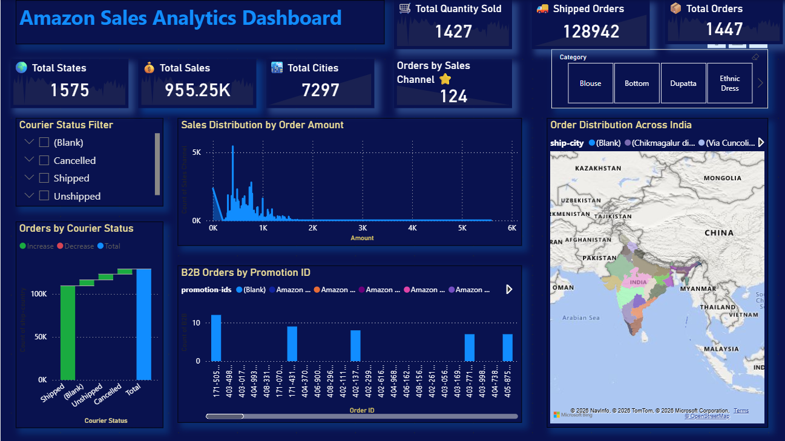

# 📊 Amazon Sales Analytics Dashboard (Power BI)

## 📌 Project Overview

The Amazon Sales Analytics Dashboard is an interactive Power BI project developed to analyze Amazon sales data and provide meaningful business insights. The dashboard combines KPIs, maps, charts, and slicers to help users explore sales performance, order trends, product categories, and regional distribution.

This project demonstrates practical skills in data visualization, business intelligence, and dashboard design using Microsoft Power BI.

# 🎯 Project Objective

The objective of this project is to transform raw Amazon sales data into a professional dashboard that enables business users to monitor performance, identify trends, and support data-driven decision-making.

# 🛠 Tools Used

- Microsoft Power BI
- Power Query
- DAX
- Data Modeling
- Data Cleaning
- Data Visualization

# 📂 Dataset Information

The dataset includes the following fields:

- Order ID
- Order Date
- Sales Amount
- Quantity
- Product Category
- Ship City
- Ship State
- Courier Status
- Sales Channel
- Promotion ID
- B2B Status
- Fulfilment

## 📊 Dashboard Preview

# 📈 Dashboard Features

### KPI Cards

- 💰 Total Sales
- 📦 Total Orders
- 🛒 Total Quantity Sold
- 🚚 Shipped Orders
- 🌍 Total States
- 🏙 Total Cities

### Interactive Filters

- Category
- Courier Status

### Visualizations

- Sales Distribution by Order Amount
- Orders by Courier Status
- B2B Orders by Promotion ID
- Order Distribution Across India (Map)
  

# 📊 Business Questions Answered

- How many total orders were received?
- What is the total sales amount?
- Which product categories perform best?
- Which states and cities have the highest order volume?
- What percentage of orders were shipped?
- How are orders distributed across India?

# 💡 Key Insights

- The dashboard provides a complete overview of Amazon sales performance.
- Interactive filters enable users to analyze data by product category and courier status.
- Geographic visualization helps identify high-performing regions.
- KPI cards provide quick access to important business metrics.
- Distribution charts highlight order and sales patterns.

# 🚀 Skills Demonstrated

- Data Cleaning
- Data Modeling
- DAX
- Power Query
- KPI Design
- Dashboard Development
- Business Intelligence
- Data Visualization
- Analytical Thinking

# 📌 Future Improvements

- Monthly Sales Trend Analysis
- Customer Segmentation
- Profit Analysis
- Return Order Analysis
- Dynamic Date Filters
- Executive Dashboard Page

# 👨‍💻 Author

Santoshi Pandalwad

Aspiring Data Analyst

### Skills

- SQL
- Excel
- Power BI
- Python
- Pandas
- NumPy
- Data Visualization
- Statistics

⭐ If you found this project useful, consider giving it a Star.
